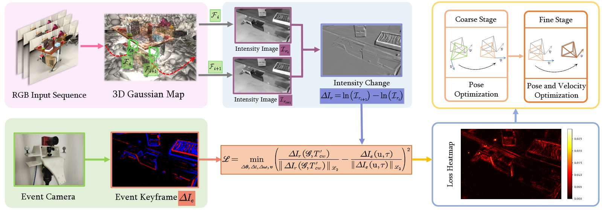

<h1 align="center">GS-EVT: Cross-Modal Event Camera Tracking based on Gaussian Splatting</h1>

<p align="center">
    <a href="https://github.com/ChillTerry">Tao Liu</a> &emsp;&emsp;
    <a href="https://github.com/peteryuan123">Runze Yuan</a> &emsp;&emsp;
    <a href="https://github.com/LEON-JU">Yi'ang Ju</a> &emsp;&emsp;
    <a href="https://github.com/XuXunnnn">Xun Xu</a> &emsp;&emsp;
    <a href="https://github.com/greatoyster">Jiaqi Yang</a> &emsp;&emsp;
    <a href="https://github.com/Launch-on-Titania">Xiangting Meng</a> &emsp;&emsp;
    <a href="https://www.linkedin.com/in/xavier-lagorce/">Xavier Lagorce</a> &emsp;&emsp;
    <a href="https://mpl.sist.shanghaitech.edu.cn/Director.html">Laurent Kneip</a> &emsp;&emsp;
</p>


<p align="center">
    <sup></sup>ShanghaiTech University
</p>

<p align="center">
    <!-- <a href="https://github.com/suhang99/EventOCC"><strong>Code</strong></a> | -->
    <a href="https://arxiv.org/pdf/2412.00816"><strong>ArXiv</strong></a> |
    <a href="https://drive.google.com/file/d/1P6MO-MmBPOZORVcgCyzRCHB-viYd3CEq/view?usp=drive_link"><strong>Video</strong></a> |
    <a href="https://drive.google.com/drive/folders/1NShkkljDLqleAGy-goFen3K0C102nIo3?usp=drive_link"><strong>Test Data</strong></a>
</p>

Over the past year and a half, **Gaussian Splatting** has garnered significant attention and is now recognized as a groundbreaking advancement in 3D Reconstruction. Consequently, the integration of **3DGS** with **event cameras** to improve localization has become a key area of research.

<p align="center">
  <a href="">
    
  </a>
</p>

To the best of our knowledge, we are proud to introduce the **first Gaussian Splatting map-based event camera tracking framework**, which leverages the differentiable and realistic novel view synthesis capability of 3DGS to enhance event camera tracking.

<p align="center">
  <a href="">
    
  </a>
</p>


## How to install
```sh
git clone https://github.com/ChillTerry/GS-EVT.git --recursive
cd GSEVT
conda create --name GSEVT python=3.7
conda activate GSEVT
pip install -r requirements.txt
cd submodules/diff-gaussian-rasterization/
pip install -e .

# you can also install from yaml
conda env create -f environment.yml
```

## How to get the dataset
We have preprocessed the [VECTOR](https://star-datasets.github.io/vector/) dataset, so you can download [here](https://drive.google.com/drive/folders/1NShkkljDLqleAGy-goFen3K0C102nIo3?usp=drive_link) and and put it in `./data/VECTOR`.

## How to run a sequence
```sh
python main.py -c configs/VECTOR/desk_normal1_config.yaml
```

## Structure of this project
```
GSEVT
├── configs                                 // Store config yamls for each sequence
├── data                                    // Store data of gs-splat maps and event data(in txt)
├── gaussian_splatting                      // original gaussian splatting modules
├── results                                 // tracking outputs
├── scripts                                 // shell scripts for batch run on server
│   ├── desk_batch_run.sh
│   ├── robot_batch_run.sh
│   └── sofa_batch_run.sh
├── submodules
│   └── diff-gaussian-rasterization         // customized rasterization module for this project
├── test                                    // test scripts
│   ├── test_event_camera.py
│   ├── test_event_rgb_overlay.py
│   ├── test_initial_pose.py
│   ├── test_intensity_change.py
│   └── test_single_frame_tracking.py
├── utils
│   ├── auxiliary.py
│   ├── event_camera
│   ├── pose.py                             // functions for calculating pose
│   ├── render_camera                       // defines Camera class and RenderFrame class
│   ├── tracker.py                          // code for tracking
│   └── visualizer.py                       // code for visualing tracking results
├── main.py                                 // run this file to start the tracking process
├── LICENSE
├── readme.txt
└── requirements.txt                        // packages needed for this project
```

## Citation
```
@article{liu2024gs,
  title={GS-EVT: Cross-Modal Event Camera Tracking based on Gaussian Splatting},
  author={Liu, Tao and Yuan, Runze and Ju, Yi'ang and Xu, Xun and Yang, Jiaqi and Meng, Xiangting and Lagorce, Xavier and Kneip, Laurent},
  journal={arXiv preprint arXiv:2409.19228},
  year={2024}
}
```
